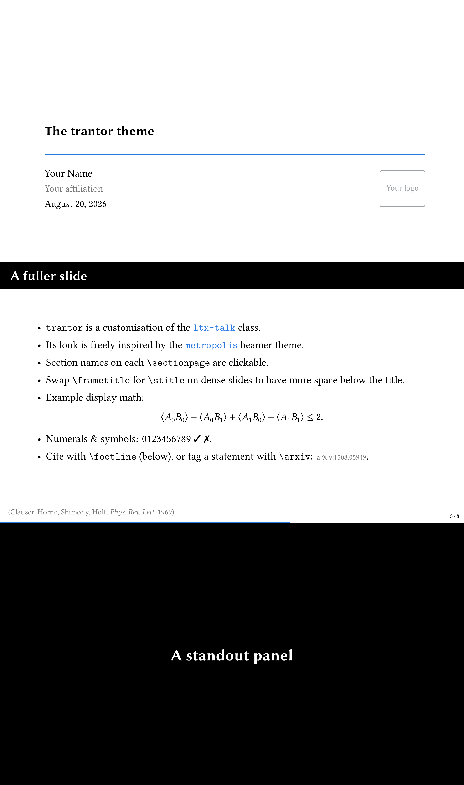

# trantor

A Metropolis-style theme for the [`ltx-talk`](https://ctan.org/pkg/ltx-talk)
presentation class: Libertinus Serif body, Libertinus Sans titles, a slim
progress bar, and tagged PDF/UA output for accessible slides.



The [demo deck](slides.pdf) is produced by `slides.tex`.

## About this fork

[Benjamin Mako Hill](https://mako.cc/)'s fork of
[mrc-pop/trantor](https://github.com/mrc-pop/trantor). It follows metropolis
more closely -- no header band on untitled frames, standout pages left out of
the frame numbering, `\alert` in the accent colour, italic quotations -- and
adds `\appendix`, `\subsectionpage`, `\plainpage`, title and divider
commands that work inside an open frame, and Libertinus maths so everything
builds on stock TeX Live.

## Requirements

- **LuaLaTeX only.** XeTeX is unsupported by ltx-talk, and the fonts load through
  fontspec / lua-unicode-math, so trantor requires LuaTeX.
- A recent TeX Live or MacTeX with the Libertinus fonts.
- Tagging is provided by ltx-talk.

trantor sets the fonts: Libertinus Serif (body), Libertinus Sans (titles) and
Libertinus Math (maths). To use a different maths font, change the
`\setmathfont` line in `trantor.sty`.

## Getting started

Copy `trantor.sty` (and a `logo.png` if you want one) next to your document and
compile `slides.tex` twice with LuaLaTeX:

```sh
lualatex slides.tex
lualatex slides.tex
```

The second pass fills in the table of contents on the section pages.
`slides.tex` is a short demo you can strip down into your own deck.

## Customising

- **Accent colour.** Sets the progress bar and the rule under the title. Define
  it anywhere in your preamble:
  ```latex
  \definecolor{accent}{HTML}{2A7AE2}
  ```
- **Logo.** Drop a `logo.png` beside your slides and it appears on the title
  page, or redefine `\titlelogo` to point at your own file. With no logo file
  the title page omits it.
- **Title spacing.** Use `\stitle{...}` instead of `\frametitle{...}` on dense
  slides to keep a clear gap below the title.
- **Standout pages.** `\standout{...}` sets a line on a full-bleed dark
  panel, left out of the frame numbering; `\standoutline{...}` is the same
  emphasis inside a normal frame.
- **Bare pages.** Frames without a `\frametitle` get no header band, and
  `\plainpage` at the top of a frame also drops the progress bar and frame
  number -- made for full-bleed images.
- **Backup slides.** Frames after `\appendix` are numbered among themselves
  and left out of the total.
- **Tick and cross.** `\yes` and `\no` give a check mark and a cross.
- **Reference footnote.** `\footline{...}` pins a small citation to the
  bottom-left of the slide.

## Building

- **Draft** (the default). Fast, no tagging. Good for writing.
- **Accessible** (PDF/UA-2). Swap the `\DocumentMetadata` line at the top of
  `slides.tex` for the tagged block below it, then compile twice. Give every
  figure an `alt={...}` description so it passes PDF/UA.
- **Handout.** Add `[handout]` to `\documentclass` to collapse overlays to one
  page per frame. This is faster while writing; remove it to see the animations.

## Credits

trantor is by [Marco Pompili](https://github.com/mrc-pop); this fork is by
Benjamin Mako Hill. Design inspired by Matthias Vogelgesang's
[Metropolis](https://github.com/matze/mtheme) beamer theme (CC BY-SA 4.0), as
an independent reimplementation for `ltx-talk`.

## License

MIT, see [LICENSE](LICENSE). The Libertinus fonts are licensed separately under
the SIL Open Font License.
